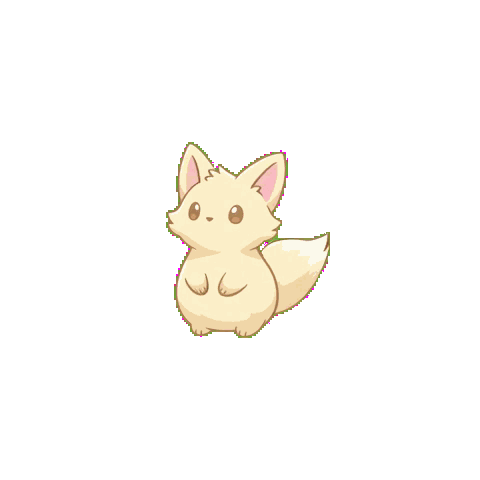
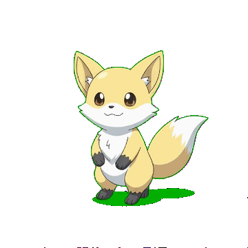
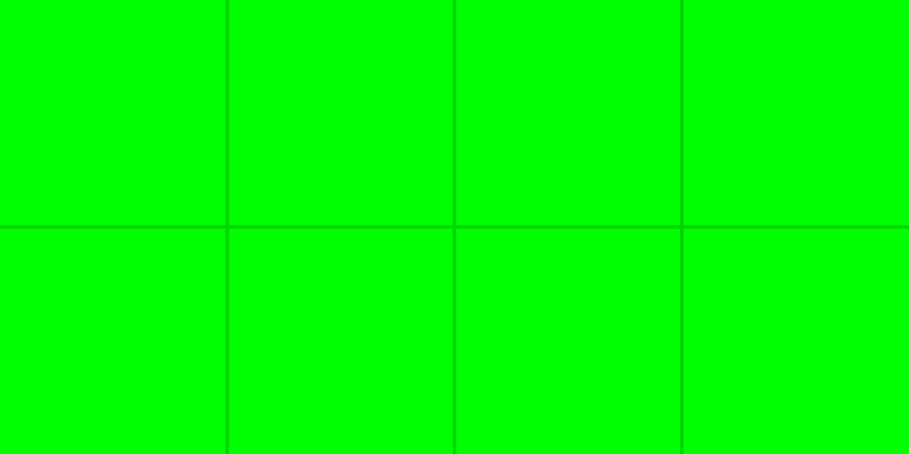
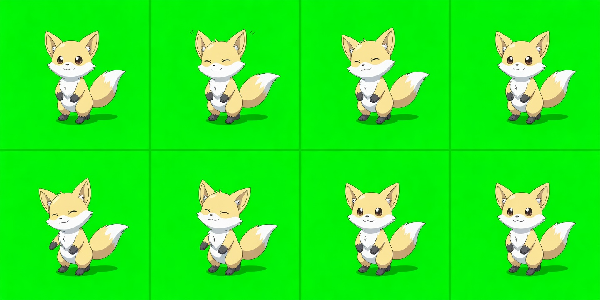
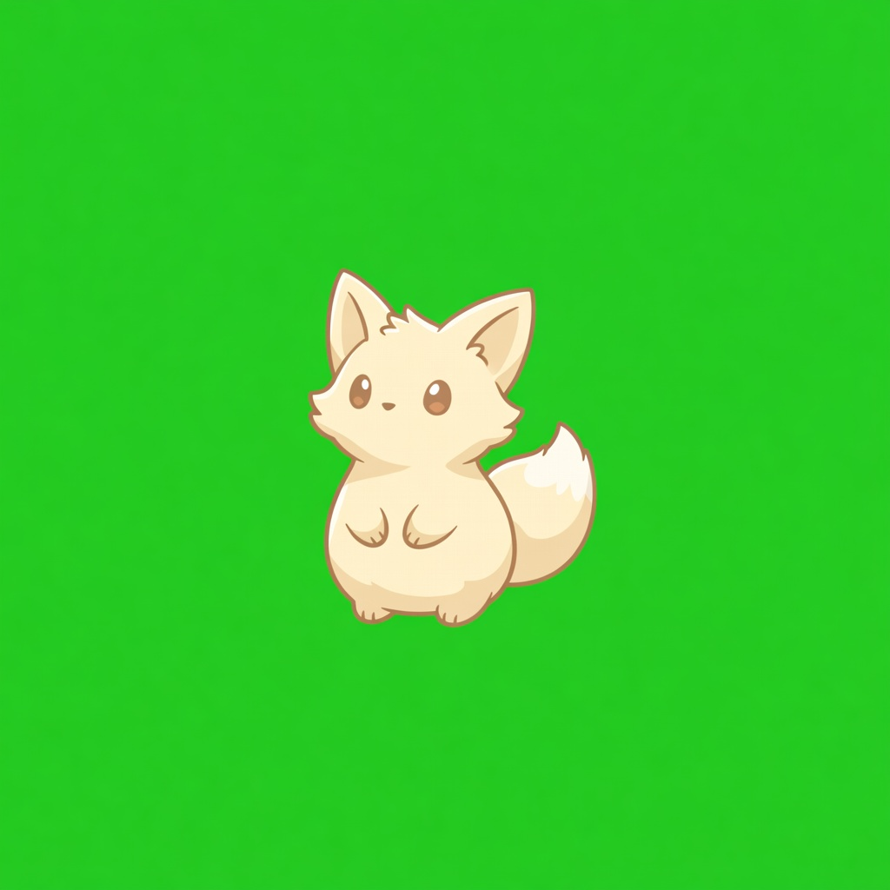

# ai-gif-skill

Turn AI-generated sprite sheets or short clips into clean GIF assets with a repeatable, file-based workflow.

This repo is packaged as a `skills.sh`-style skills collection. The installable skill lives in [`skills/ai-gif-skill`](skills/ai-gif-skill).

<p align="center">
  
  
</p>

## Install

```bash
npx skills add Wangnov/ai-gif-skill --skill ai-gif-skill
```

After installation, the main CLI entrypoint is:

```bash
uv run --project ~/.agents/skills/ai-gif-skill ai-gif-skill ...
```

## What This Skill Does

There are two supported workflows:

1. `template -> generate-sheet -> cutout -> gif-from-sheet`
2. `generate-image -> generate-video -> extract-frames -> cutout-frames -> gif-from-frames`

The local post-processing steps are provider-neutral. The generation steps can mix Gemini and Grok when needed.

## Recommended Defaults

These recommendations are based on real local verification on **April 8, 2026**.

| Goal | Recommended provider | Why |
| --- | --- | --- |
| Sprite sheet generation | `Gemini` | Better at respecting the provided grid template and preserving sheet layout. |
| Video generation | `Grok` | Better fit for keyed-background animation workflows and fewer practical constraints for the tested setup. |
| Gemini video | Compatibility path, not the default recommendation | It works, but it currently has stricter duration and aspect-ratio limits and tends to recompose the frame background. |

If you only want one safe starting point:

- Use `Gemini` for the **sheet workflow**
- Use `Grok` for the **video workflow**

## Example Gallery

### Sprite Sheet Workflow

| Pure key-color template | Generated sprite sheet | Final GIF |
| --- | --- | --- |
|  |  |  |

### Video Workflow

| Reference image | Final GIF |
| --- | --- |
|  |  |

## Quick Start

### 1. Sheet Workflow

Recommended default: `Gemini`

```bash
mkdir -p /tmp/ai-gif-sheet-demo/out
cd /tmp/ai-gif-sheet-demo

uv run --project ~/.agents/skills/ai-gif-skill ai-gif-skill template \
  --rows 2 \
  --cols 4 \
  --cell-width 384 \
  --cell-height 384 \
  --background '#00FF00' \
  --output-svg ./out/template.svg \
  --output-png ./out/template.png

uv run --project ~/.agents/skills/ai-gif-skill ai-gif-skill generate-sheet \
  --provider gemini \
  --input-image ./out/template.png \
  --output-image ./out/generated.png \
  --rows 2 \
  --cols 4 \
  --cell-width 384 \
  --cell-height 384 \
  --background '#00FF00' \
  --prompt 'one original cute beast, pokemon-inspired but fully original, clean 2D cel-shaded anime game art, non-pixel-art, full body, locked front 3/4 view, exactly one character, 8-frame idle loop for a game sprite sheet, torso stays centered on the same vertical axis in every frame, feet stay planted in the same place, do not rotate to side view, use clear full-body motion: chest inhale and exhale, slight up-down body bob, alternating ear tilt, tail curl left to center to right to center, subtle paw lift and settle, brief blink near frame 4, return close to the starting pose by frame 8 for a clean loop, each frame should show a readable pose difference and not only facial expression changes, no scene, no props'

uv run --project ~/.agents/skills/ai-gif-skill ai-gif-skill cutout \
  --input-image ./out/generated.png \
  --output-image ./out/cutout.png

uv run --project ~/.agents/skills/ai-gif-skill ai-gif-skill gif-from-sheet \
  --input-sheet ./out/cutout.png \
  --output-gif ./out/final.gif \
  --rows 2 \
  --cols 4 \
  --duration-ms 167
```

### 2. Video Workflow

Recommended default: `Grok`

```bash
mkdir -p /tmp/ai-gif-video-demo/out
cd /tmp/ai-gif-video-demo

uv run --project ~/.agents/skills/ai-gif-skill ai-gif-skill generate-image \
  --provider grok \
  --output-image ./out/character.png \
  --prompt 'a small fox spirit game asset on pure green background, centered, no scene, no props'

uv run --project ~/.agents/skills/ai-gif-skill ai-gif-skill generate-video \
  --provider grok \
  --output-video ./out/clip.mp4 \
  --reference-image ./out/character.png \
  --duration-seconds 2 \
  --aspect-ratio 1:1 \
  --prompt 'animate this exact same character with a subtle looping idle motion on the same pure green background'

uv run --project ~/.agents/skills/ai-gif-skill ai-gif-skill extract-frames \
  --input-video ./out/clip.mp4 \
  --output-dir ./out/frames \
  --fps 6

uv run --project ~/.agents/skills/ai-gif-skill ai-gif-skill cutout-frames \
  --input-dir ./out/frames \
  --output-dir ./out/cutout-frames \
  --mode color \
  --tolerance 48

uv run --project ~/.agents/skills/ai-gif-skill ai-gif-skill gif-from-frames \
  --input-dir ./out/cutout-frames \
  --output-gif ./out/final.gif \
  --duration-ms 167
```

## Why These Defaults

### Why `Gemini` for sprite sheets

- It follows the provided guide grid more reliably.
- It behaves better when asked to preserve a fixed `rows x cols` layout.
- It is the better default when the output must remain a clean sheet instead of a freeform illustration.

### Why `Grok` for video

- It handled the tested keyed-background animation workflow more naturally.
- It was easier to use for the tested `1:1` short-loop asset flow.
- It fits the “reference image -> short loop -> frames -> GIF” path more smoothly in this repo’s current setup.

## Practical Notes

- The default key color is chroma green: `#00FF00`.
- The default sheet grid is `2x8` with `768x768` cells, but smaller grids like `2x4` are often faster for quick iteration.
- The template PNG, generated sheet PNG, and cutout sheet PNG carry layout metadata. The sheet commands validate that metadata.
- Frame workflows write a `frames_manifest.json` file next to extracted or cutout frame folders.
- For compressed video frames, background removal is often more reliable when the tool estimates the border color automatically instead of assuming exact `#00FF00`.

## Provider Notes

### Gemini Video

Gemini video is still supported, but it is **not the default recommendation** for this skill.

In the tested setup, Gemini video required provider-specific constraints such as:

- supported aspect ratios instead of arbitrary `1:1`
- durations within Gemini’s accepted range
- reference images packed in the exact SDK format

That is why the skill now recommends:

- `Gemini` for **sheet generation**
- `Grok` for **video generation**

## Main Commands

- `template`
- `generate-sheet`
- `generate-image`
- `generate-video`
- `extract-frames`
- `cutout`
- `cutout-frames`
- `gif-from-sheet`
- `gif-from-frames`
- `sheet-pipeline`
- `video-pipeline`

Legacy aliases:

- `generate` -> `generate-sheet`
- `gif` -> `gif-from-sheet`

## Validation

```bash
uv run --project skills/ai-gif-skill --extra dev pytest tests -q
uv run --project skills/ai-gif-skill --with pyyaml python /Users/wangnov/.codex/skills/.system/skill-creator/scripts/quick_validate.py skills/ai-gif-skill
```
